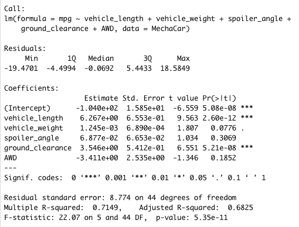
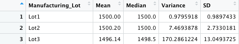
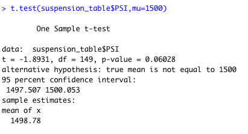
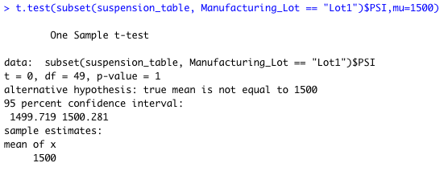
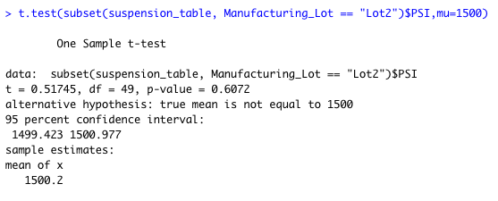
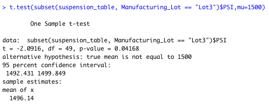

# MechaCar Statistical Analysis

## Linear Regression to Predict MPG
### By designing a linear model that predicts the mpg of MechaCar prototypes using several variables, the following questions were answered.

* Which variables/coefficients provided a non-random amount of variance to the mpg values in the dataset?

Vehicle length and ground clearance provide non-random variance with 6.267e+00 and 3.546e+00 variances respectively. The other outcomes were closer to 1 or in the negative.

* Is the slope of the linear model considered to be zero? Why or why not?

The slope of the linear model is not considered to be zero because the p-value is 5.35e-11 which is larger than 0.05.

* Does this linear model predict the mpg of MechaCar prototypes effectively? Why or why not?

Yes, this linear model predicts the mpg of MechaCar's effectively. The R-squared calculation is 0.7149 which means that 71% of the time the linear model will predict mpg correctly.

## Summary Statistics on Suspension Coils
### The weight capacities of multiple suspension coils were tested to determine if the manufacturing process is consistent across production lots. 

The design specifications for the MechaCar suspension coils dictate that the variance of the suspension coils must not exceed 100 pounds per square inch.

* Does the current manufacturing data meet this design specification for all manufacturing lots in total and each lot individually? Why or why not?

The variance for the total lot specification is 62.29356. This does not exceed the 100 pounds per square inch requirement and therefore meets the manufacturing design specification. However, looking at the lots individually, not all lots meet the requirements. Both Lot 1, with a 0.9795918 variance, and Lot 2, with a variance of 7.4693878, are very much under the requirement. On the other hand, Lot 3 has a variance of 170.2861224.

## T-Tests on Suspension Coils
### T-tests determine if all manufacturing lots and each lot individually are statistically different from the population mean of 1,500 pounds per square inch.

Looking at the t-test that compares all manufacturing lots against mean PSI of the population, the p-value is 0.06028.

Individually, Lot 1 has a p-value of 1 and Lot 2 has a p-value of 0.6072. Both lots are close to the 0.05 limit, but still above. Lot 3 has a p-value of 0.04168 which is below the significance level.

